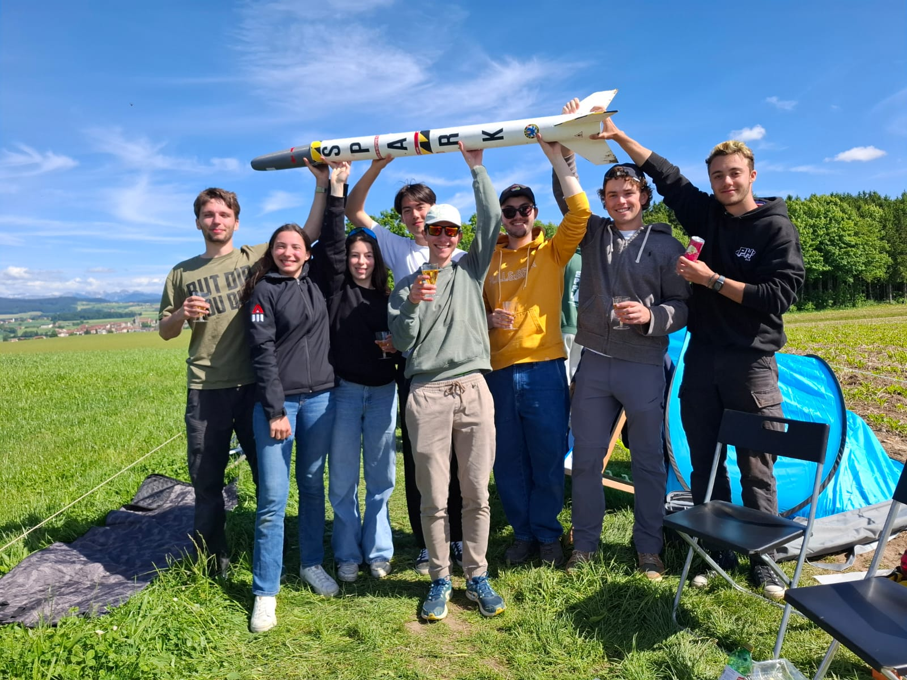
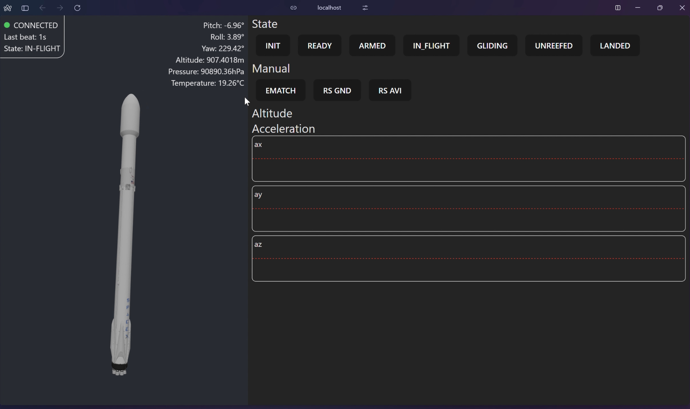

# Avionics for S.P.A.R.K (a SpaceRace V Rocket from the EPFL Rocket Team)

S.P.A.R.K is an L1-class rocket built by eight first-year EPFL students from various sections. It features a reefing recovery system and live telemetry.

This repository contains the code for the onboard avionics of the S.P.A.R.K rocket, as well as the code for the ground station, telemetry display, and some flight data collected on May 24, 2025, during the SpaceRace V event organized by the [EPFL Rocket Team (ERT)](https://epflrocketteam.ch/).

This is a complete rewrite of the avionics v1 software, started on **May 21** — yes, just three days before liftoff 😅. As a result, the code is not optimized. The main goal was to have something functional that could recover from errors during flight, handle all necessary events, and send telemetry to the ground. **IT IS NOT MEANT TO BE PRETTY**, and some parts are missing (RIP CRC16 checksum 😬).

All the code that fetches data from the three onboard sensors (MPU, BMP, and QMC) was written by my good friend @dandyfellow — kudos to him! The rest of the code is my own.

The data collected during the flight on May 24, both from the ground station and the avionics, is available as raw and partially processed CSV files under `./flight/raw`.

## Components

This repository consists of five components:

-   Onboard avionics
-   Ground station
-   UART<->WebSocket connector
-   Live telemetry website
-   Telemetry replay / flight gallery

### Onboard Avionics

This component is located at the root of the repo. To use or compile it, you'll need the **ESP-IDF tools**, and you must set the `IS_GROUND_STATION` flag to `0` at build time.

### Ground Station

Also located at the root of the repo and mixed with the avionics code. Thanks to the `IS_GROUND_STATION` compile-time flag, you can build this component separately from the avionics. To compile it, use the ESP-IDF tools and set `IS_GROUND_STATION` to `1`.

### Go Connector

A simple Go program that opens a COM port on the host machine, waits for incoming communication, checks if it should be relayed, logs it to a file, and forwards it to a WebSocket available on the host. The code is located in the `./server` folder.

### Live Telemetry

A React web app used to display incoming telemetry data from the WebSocket, and send commands to the onboard avionics. The code is located in the `./web` folder.

### Telemetry Replay

Another React web app used to visualize telemetry data. It's also a way to preserve the memory of this project and all the hard work that went into it. The code is located in the `./flight/flight-viewer` folder.

## Credit

First of all, a huge thank you to the [EPFL Rocket Team](https://epflrocketteam.ch/) for organizing the event and guiding us through the design, review, and building stages — and for giving us a **300 CHF** budget to work with.

Thanks also to all the team members who contributed to the rocket (structure, recovery system, and more).

And finally, a special thanks to @dandyfellow for his help with the sensor code and setting up the sensor fusion library. 🚀
